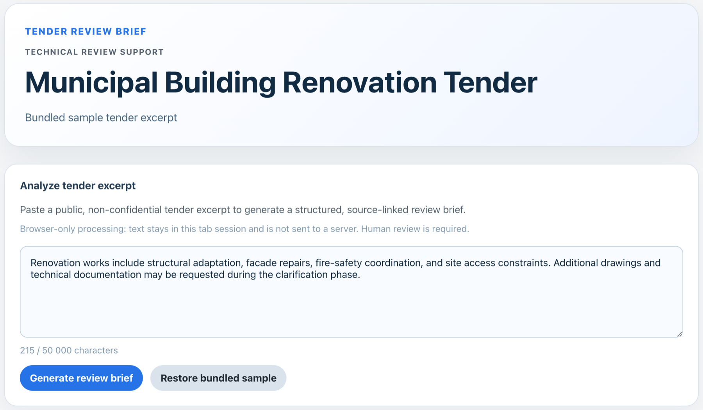
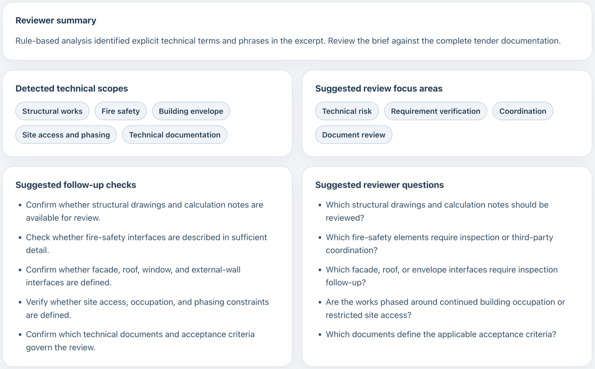
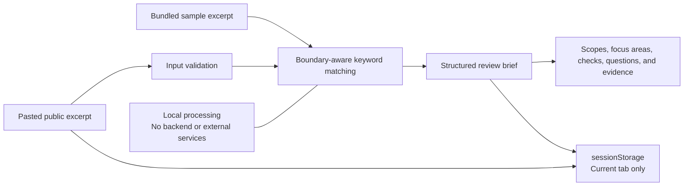

# Tender Review Brief

Tender Review Brief turns public construction tender excerpts into structured, source-linked review briefs.

The application uses an explicit set of boundary-aware keyword rules to identify technical scopes, review focus areas, follow-up checks, reviewer questions, and supporting source passages. It is designed to support, not replace, human technical review.

**Live application:** [Open Tender Review Brief](https://nikolayair.github.io/tender-review-brief/)

**Stack:** React · JavaScript · CSS · Vite · Vitest · ESLint

## Interface





## What it does

* Generates a structured review brief from a pasted public tender excerpt.
* Matches explicit English and selected French construction terms using predefined review rules.
* Pairs each matched rule with a supporting passage from the source text.
* Separates detected scopes, review focus areas, follow-up checks, reviewer questions, and evidence.
* Uses boundary-aware matching to reduce false positives from terms embedded inside longer words.
* Produces deterministic results from an explicit, inspectable rule set.
* Processes text locally in the browser without a backend or external service.
* Restores the current excerpt and generated brief after a reload when `sessionStorage` is available.
* Includes a bundled sample excerpt with a brief derived from the same analysis rules.

## Reviewer workflow

1. Paste a public, non-confidential tender excerpt.
2. Generate a structured review brief.
3. Review the detected scopes and suggested focus areas.
4. Check the suggested follow-up checks and reviewer questions against the complete tender documentation.
5. Confirm each finding through human technical review.

The reviewer remains responsible for interpreting the source material and deciding what requires further investigation.

## How it works



## Current scope

The current rule set covers explicit signals related to structural works, fire safety, accessibility, the building envelope, water and drainage systems, site access and phasing, and technical documentation.

The interface accepts excerpts of up to 50,000 characters. Automated tests cover input validation, matching safeguards, evidence links, bundled-sample consistency, stored-brief validation, and browser-storage fallbacks.

## Known limitations

* The analyzer uses keyword rules rather than semantic or contextual language understanding.
* Technical areas outside the current rule set will not be detected.
* French-language support is limited to selected construction terms.
* Evidence extraction returns the first matching source passage for each rule.
* Multiple matched rules may reference the same source passage.
* The application does not fetch URLs, scrape websites, parse PDFs, or perform OCR.
* Browser storage is best-effort, limited to the current tab session, and may be unavailable under some browser settings.
* The application does not provide document history, authentication, or multi-user workflows.
* The rules have not been validated across a representative collection of tender documents.
* Every generated brief requires human technical review.

## Local development

Install dependencies:

```bash
npm ci
```

Run the development server:

```bash
npm run dev
```

Run the automated checks:

```bash
npm test
npm run lint
npm run build
```

Run dependency audits:

```bash
npm audit --omit=dev
npm audit
```

## License

No open-source license is currently granted. All rights reserved.

You may view this repository and use GitHub's standard platform features. Copying, redistribution, modification, or reuse beyond those features requires prior permission.
