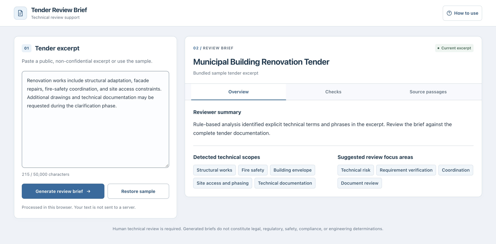
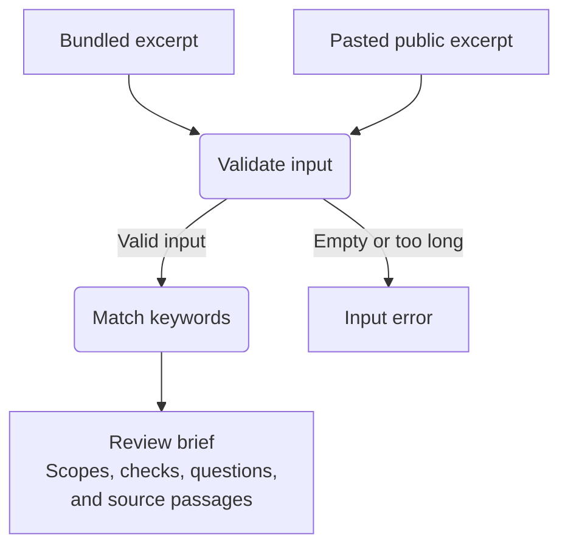

# Tender Review Brief

Technical review briefs from public construction tender excerpts.

The application uses predefined keyword rules to suggest technical scopes, review focus areas, follow-up checks, and questions. Reviewers check the supporting source passages against the complete tender documents. All text processing runs in the browser.

[Open the application](https://nikolayair.github.io/tender-review-brief/)



## Review workflow

1. Choose **Restore bundled sample** to try the example, or paste public, non-confidential text into **Analyze tender excerpt**.
2. Choose **Generate review brief**, then review the detected scopes, suggested checks, and questions.
3. Read the supporting source passages in context and check the complete tender documents before deciding what needs further investigation.

After editing the excerpt, generate the brief again. Editing alone leaves the previous result visible, including after a reload.


## How it works

The React interface checks the input and applies English and selected French keyword rules. Matching uses word boundaries to avoid terms embedded inside longer words. The bundled example uses the same rules as pasted text. No backend, API key, or external text-processing service is required.


```mermaid
flowchart TD
    accTitle: Tender review brief generation
    accDescr: A bundled or pasted excerpt is validated, then matched against keyword rules to produce a review brief. Empty or oversized input produces an error.
    sample["Bundled excerpt"] --> validate("Validate input")
    pasted["Pasted public excerpt"] --> validate
    validate -->|Valid input| rules("Match keywords")
    validate -->|Empty or too long| error["Input error"]
    rules --> brief["Review brief<br/>Scopes, checks, questions,<br/>and source passages"]
```

For each matched rule, the brief quotes the paragraphs containing its earliest match. Overlapping passages appear once, and long quotes can be expanded without losing text. See [how source passages are selected](docs/evidence.md) for paragraph boundaries, formatting, and limits.

When browser storage is available, the current excerpt and last generated brief are saved separately in `sessionStorage` and restored on reload. Storage is best-effort; the application provides no document history or shared workspace.

## Run locally

Use Node.js **26.13.1**, pinned in [`.nvmrc`](.nvmrc) and used by CI. With [Git](https://git-scm.com/downloads) and [nvm](https://github.com/nvm-sh/nvm) installed:

```bash
git clone https://github.com/NikolayAir/tender-review-brief.git
cd tender-review-brief
nvm install
nvm use
npm ci
npm run dev
```

Open the local URL printed by Vite. If you use another Node.js manager, select the pinned version before running `npm ci`. The supported Node.js line is 26.x, declared in [package.json](package.json).

See [development](docs/development.md) for checks, browser setup, rule changes, and deployment.

## Scope and validation

The rules cover structural works, fire safety, accessibility, building envelope, water and drainage systems, site access and phasing, and technical documentation. Input is limited to 50,000 characters, counted as JavaScript UTF-16 code units.

Matching identifies declared keywords; it does not interpret whether work is included, excluded, or negated. If no rule matches, the brief asks for manual review. French coverage is limited to selected construction terms. Conditions outside the quoted paragraphs may still affect a requirement.

Automated tests cover matching, quote preservation, stored-brief validation, storage failures, keyboard interaction, and narrow layouts. The rules have not been validated against a representative collection of tenders, so no accuracy estimate is claimed. See [browser checks](docs/testing-evidence.md) for repeatable manual examples.

PDF ingestion, URL fetching, OCR, brief export, saved reviewer decisions, authentication, and shared review sessions are not implemented. Briefs restored from older sessions keep their previous content until a new brief is generated.

The output supports human technical review. It does not make legal, regulatory, safety, compliance, or engineering determinations.

## Documentation

| Document | Contents |
| --- | --- |
| [Source passages](docs/evidence.md) | Match selection, paragraph context, shared quotes, formatting, and limits |
| [Development](docs/development.md) | Local checks, browser setup, project structure, rule changes, and deployment |
| [Browser checks](docs/testing-evidence.md) | Manual examples for quote formatting, keyboard interaction, and narrow layouts |

## Releases and support

See the [changelog](CHANGELOG.md) and [GitHub Releases](https://github.com/NikolayAir/tender-review-brief/releases) for versioned release notes. Documentation on `main` describes current development; use the documentation at a release tag for that version.

Use [GitHub Issues](https://github.com/NikolayAir/tender-review-brief/issues) for reproducible bugs and feature requests. Report suspected vulnerabilities privately as described in [SECURITY.md](SECURITY.md).

## License

No open-source license is currently granted. All rights reserved.

You may view this repository and use GitHub's standard platform features. Copying, redistribution, modification, or reuse beyond those features requires prior permission.
